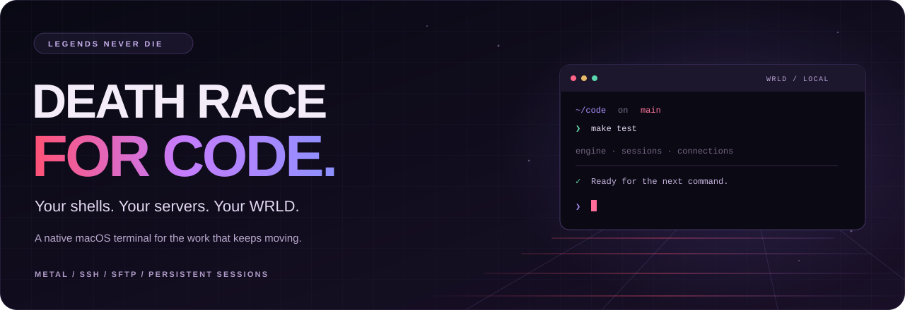
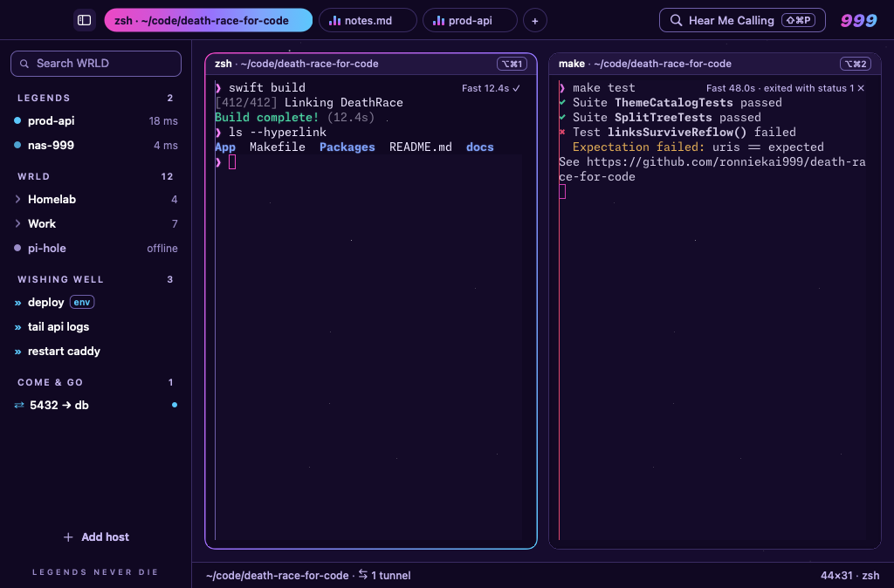
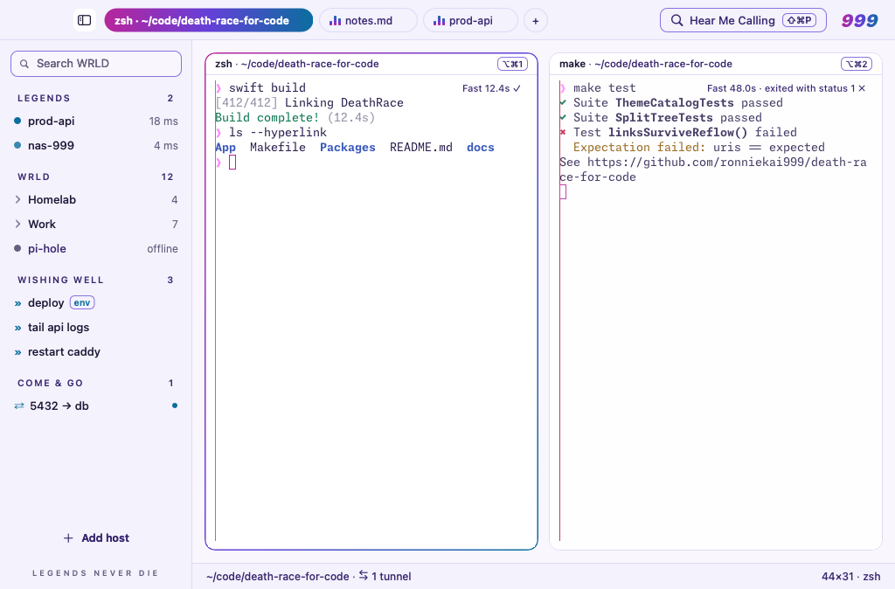
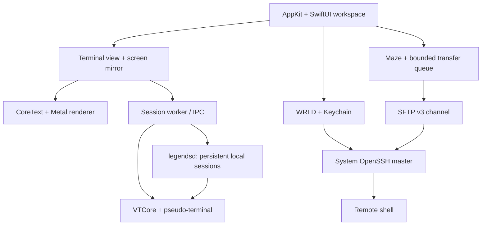

<div align="center">



# Death Race for Code

**A native macOS terminal. A home for your servers. A workspace that keeps going.**

[](#get-started)
[](#development)
[](docs/ARCHITECTURE.md)
[](#roadmap)
[](https://github.com/ronniekai999/death-race-for-code/actions/workflows/macos.yml)
[](https://github.com/ronniekai999/death-race-for-code/actions/workflows/linux.yml)

[Features](#features) · [Get started](#get-started) · [Shortcuts](#shortcuts) · [Settings](#settings) · [Privacy & data](#privacy--data) · [Development](#development) · [Roadmap](#roadmap)

</div>

---

Death Race for Code brings local shells, SSH hosts, file transfers, and persistent sessions
into one Mac workspace. Its terminal engine and Metal renderer are written in Swift; its
connections use macOS's OpenSSH. Tabs, split panes, a command palette, and a quick terminal
keep the next task close. Eight original themes give it the Juice WRLD identity it shares
with MenuGlance.

> **Source preview.** Build and run on macOS 26 or later. The implemented features are
> covered by portable and native CI; hands-on Mac acceptance remains open. A Developer ID
> signing and notarization workflow is prepared, with distribution acceptance still to do.
> See the [implementation review](docs/IMPLEMENTATION-REVIEW.md) for evidence and next steps.

| Legends Never Die | Righteous |
| --- | --- |
|  |  |

Native fixture previews from macOS CI. The commands and hosts are scripted examples,
including a failed-command example; window-server effects are omitted.
See [asset provenance](docs/assets/README.md).

<a id="features"></a>
## Built for the whole session

### A terminal with its own engine

- **Native rendering.** AppKit, SwiftUI, CoreText, and Metal, with event-driven drawing that
  stops when the terminal is idle.
- **Modern terminal behavior.** Unicode 18 graphemes, true color, resize reflow, OSC 8 links,
  mouse reporting, input methods, and the Kitty keyboard protocol.
- **Find in history.** ⌘F searches logical lines across soft wraps, highlights matches, and
  lets you move through up to 1,000 results with ⌘G and ⇧⌘G.
- **Accessible terminal text.** A bounded viewport text area exposes selection and line
  coordinates to macOS accessibility. VoiceOver acceptance is tracked in the manual suite.
- **Ligatures, glow, and images.** Font ligatures preserve cell positions; bright colors can
  glow in dark themes. Direct Kitty RGB, RGBA, and PNG images render within explicit limits.
- **XDR Neon.** Opt-in extended brightness for saturated colors on capable displays, with
  SDR fallback in Low Power Mode or at serious thermal pressure. White text stays SDR.

### Your servers, in WRLD

- **Hosts that stay organized.** Cards, groups, favorites, keys, known hosts, and an inspector;
  import hosts from `~/.ssh/config` without rewriting it.
- **OpenSSH connections.** One app-owned master per host lets additional panes share the
  login. Password, verification-code, and host-key questions appear as native sheets.
- **Keychain and Touch ID.** Saved passwords live in the login Keychain. Secure Enclave keys
  can be created and installed from the New Host flow.
- **Come & Go.** Manage local, remote, and SOCKS tunnels on a live connection.
- **Wishing Well.** Reusable snippets with `{{placeholders}}`, plus a startup snippet per host.
- **Armed and Dangerous.** ⇧⌘I broadcasts input to the panes in a tab; the armed border makes
  the mode visible.

### Files through Maze

Maze puts this Mac's folder beside the remote folder, using an SFTP channel on the existing
SSH master. Upload, download, drag between the panes, or drop Finder files onto the host.

Transfers use bounded 32 KiB chunks and an eight-request pipeline. Fresh destination checks
and explicit replacement approval protect existing files; staged downloads publish only
after success. Progress updates are capped at 20 Hz, and transfers support cancellation and
request deadlines. Dragging remote files out to Finder remains deferred.

### A workspace that remembers

- **The Pit Lane.** Tabs, nested splits, pane zoom, a WRLD sidebar, and **Hear Me Calling**, the
  command palette for actions, hosts, snippets, and tunnels.
- **Legends Never Die.** A local daemon keeps shells and scrollback alive across app quit or
  crash. Relaunch restores split directions and ratios, focus, zoom, selected tabs, and
  window frames. Closing a pane still ends its shell; SSH sessions end with the app.
- **Lucid Dreams.** ⌥Space reveals a quick terminal from the notch, retaining its session
  across hide and show and coordinating with MenuGlance.
- **Conversations.** Shell integration for zsh, bash, and fish marks command blocks, durations,
  and exit status. Jump between prompts, select a command with its output, keep personal
  bests, and receive a notification when a long command finishes elsewhere.

The daemon's macOS privacy inheritance, physical-display behavior, and energy/performance
budgets still require the [Mac acceptance pass](docs/MAC-ACCEPTANCE.md).

<a id="get-started"></a>
## Get started

### Requirements

| Requirement | What you need |
| --- | --- |
| Mac | macOS 26 or later with a Metal-capable GPU |
| Toolchain | Xcode 26 with Swift 6.2 or later and command-line tools selected |
| Build tools | Git, Make, and Python 3 |
| First build | Network access for the pinned bundled-font downloads |
| Signing | A stable Apple Development identity is recommended for Keychain and privacy continuity |

An Apple M5 is the target for the documented absolute throughput acceptance budgets; it is
not required to build the app.

**1. Clone the repository.**

```sh
git clone https://github.com/ronniekai999/death-race-for-code.git
cd death-race-for-code
```

**2. Build and launch.**

```sh
CONFIG=debug make run
```

This builds `build/Death Race for Code.app`, bundles fonts and helpers, signs it with an
available Apple Development identity, and opens it. With no identity, development builds
use ad-hoc signing. The debug build adds frame statistics and privacy-spike tools.

**3. Make it yours.**

Open **Settings…** with ⌘, to choose a theme and font. Open **WRLD** with ⌘O to add a host,
or start with the local shell. Use `make run` for a release-optimized development build;
`make bundle` builds the app without opening it. You can copy the bundle into Applications.

To select a specific development identity:

```sh
SIGN_IDENTITY='Apple Development: Your Name (TEAMID)' make run
```

For distribution signing and notarization, follow [the release guide](docs/RELEASE.md).

<a id="shortcuts"></a>
## Keep your hands on the keyboard

| Action | Default shortcut |
| --- | --- |
| New window / new tab | ⌘N / ⌘T |
| Split right / split down | ⌘D / ⇧⌘D |
| Close pane | ⌘W |
| Zoom pane | ⇧⌘Return |
| Command palette — Hear Me Calling | ⇧⌘P |
| Open WRLD / toggle its sidebar | ⌘O / ⌃⌘S |
| Quick terminal — Lucid Dreams | ⌥Space |
| Broadcast input — Armed and Dangerous | ⇧⌘I |
| Find / next match / previous match | ⌘F / ⌘G / ⇧⌘G |
| Previous prompt / next prompt | ⌘↑ / ⌘↓ |
| Select command and output | ⇧⌘A |
| Larger / smaller / reset text | ⌘+ / ⌘− / ⌘0 |
| Settings | ⌘, |

Menus, the palette, and **Settings › Keys** share one action catalog. Lucid Dreams' global
shortcut is configurable.

<a id="settings"></a>
## Your settings, in a file

Settings live in `~/.config/deathrace/config`, or `$XDG_CONFIG_HOME/deathrace/config` when
set. The native settings window edits one line at a time and preserves the rest; **Open
Settings File** opens an explained template in your editor. Both paths apply changes live.

```ini
theme = lucid-dreams
font-family = Monaspace Neon
font-size = 14
font-ligatures = true
text-glow = true
xdr-neon = false
legends-never-die = true
paste-protection = true
scrollback-limit = 50MB
```

This is a sample configuration. XDR is opt-in; ligatures require a supporting font. Put
comments on their own lines: a `#` inside a value is part of that value. Invalid settings
produce a diagnostic and leave that setting at its default.

| Theme | Configuration value |
| --- | --- |
| Legends Never Die | `legends-never-die` |
| Lucid Dreams | `lucid-dreams` |
| Goodbye & Good Riddance | `goodbye-good-riddance` |
| Death Race for Love | `death-race-for-love` |
| Fighting Demons | `fighting-demons` |
| Wishing Well | `wishing-well` |
| The Party Never Ends | `the-party-never-ends` |
| Righteous — light | `righteous` |

<a id="privacy--data"></a>
## Privacy & data

Connection traffic uses the system OpenSSH client. WRLD's configuration holds host details
and key-file paths; private keys remain in their configured location or the Secure Enclave.
Saved passwords live in the login Keychain.

```text
~/.config/deathrace/
├── config          # Human-readable settings; respects XDG_CONFIG_HOME
└── wrld.json       # Hosts, groups, snippets, tunnels, and key paths

~/.deathrace/
├── state.json      # Runtime host metadata: recent connections, OS, latency, use counts
├── bests.json      # Personal command bests, when bests-on-disk is enabled
├── ssh_config      # Generated connection configuration
├── keys/           # Secure Enclave key handles
├── cm/             # OpenSSH control sockets
└── run/            # Daemon socket, lock, and log; owner-only directory (0700)
```

`wrld.json` is designed for dotfiles, but host names, snippets, and paths can be sensitive.
Review them before sharing. Keychain passwords are not written to it. Local sessions can
keep running after quit when Legends Never Die is enabled; closing their panes ends them.
Workspace layout is stored in the running daemon's session metadata. Control sockets use
the per-user temporary directory when the home path would exceed the Unix socket limit.

The daemon's permission inheritance is an explicit acceptance item. Its investigation and
required before/after-quit evidence are documented in [the privacy spike](docs/SPIKE.md).

<a id="troubleshooting"></a>
## When something needs attention

| Symptom | Where to start |
| --- | --- |
| Build reports an old SDK or Swift version | Check `xcodebuild -version`, `swift --version`, and `xcode-select -p`; select Xcode 26's tools. |
| Bundling stops while fetching fonts | Check network access and retry. The fetch script checks pinned font hashes. |
| Keychain or privacy approval changes after rebuilding | Use the same Apple Development identity; ad-hoc signatures change with each build. |
| Local sessions do not return | Check `legends-never-die`, the status-bar fallback message, and `~/.deathrace/run/`. Follow the privacy spike for permission issues. |
| An SSH connection needs another answer | Use the native askpass sheet; verify the host's key and authentication settings in WRLD. |
| A transfer asks about replacement again | Maze rechecks the destination before starting. Review the current file and approve the new request. |
| An inline image is rejected | The current Kitty subset supports direct RGB/RGBA/PNG data within bounds. File transports, compression, animation, Sixel, and iTerm images are not supported. |
| XDR looks like ordinary brightness | Enable `xdr-neon` on a capable display; Low Power Mode, thermal pressure, and display headroom control fallback. |
| `make test-render` writes PNGs and fails | Review the six generated baselines before committing them; see [Mac acceptance](docs/MAC-ACCEPTANCE.md). |
| The GUI will not build on Linux | Linux builds the portable engine, sessions, SSH/SFTP, and app logic. AppKit and Metal targets require macOS. |

<a id="development"></a>
## Development & verification

Open `Packages/DeathRaceKit/Package.swift` in Xcode, or use the Make targets:

```sh
make test          # Package tests; portable targets on Linux, all targets on macOS
make lint          # Swift formatting and static checks
make smoke         # Bundle and exercise a shell, renderer, and helpers on macOS
make test-render   # Compare six recorded-program screens with reviewed PNG baselines
make esctest       # xterm conformance suite against VTCore; needs Python 3
make fuzz          # libFuzzer; use the swift.org toolchain, not Xcode's
make bench         # Release-engine throughput
make vtdiff        # Compare throughput and corpus screens with pinned SwiftTerm
```

On supported Ubuntu, `make install-swift-linux` installs the signature-verified Swift 6.3.3
toolchain. The Linux CI also runs real loopback SSH/SFTP and zsh/bash/fish integration,
fuzzing, and Thread Sanitizer. macOS CI builds the app, tests windows and both shader paths,
renders the corpus and all eight themes, and checks the bundled app and helper signatures.

The engine's conformance floor is **469 of 532 esctest cases**. Each excluded case is named
in [CONFORMANCE.md](docs/CONFORMANCE.md), including intentional window-control restrictions
and differences tied to xterm's own display behavior. Recorded vim, nvim, tmux, htop, fzf,
and nano sessions complement the protocol tests.

`vthost` is the headless engine host: `run -- program` starts a program, `replay file` prints
a recording's final screen, `frame file` shows a colored frame, and `bench` measures throughput.

### Architecture



| Location | Responsibility |
| --- | --- |
| `Packages/DeathRaceKit/Sources/VTCore` | Parser, terminal state, Unicode, reflow, input, graphics |
| `ScreenProtocol`, `SessionKit`, `SessionIPC`, `PTYKit` | Screen deltas, workers, daemon wire, and shell lifecycle |
| `RenderKit`, `SurfaceCore`, `TerminalUI` | Fonts, Metal, selection, accessibility, and terminal presentation |
| `Vault`, `SSHKit`, `SFTPKit` | Host data, OpenSSH, and file-transfer protocol/IO |
| `AppCore`, `LegendsUI`, `DeathRaceApp` | Portable app logic, visual system, and native workspace |
| `Tools/VTFuzz`, `Tools/VTDiff` | Fuzzing and an independent terminal comparison |
| `scripts`, `.github/workflows`, `docs` | Build, acceptance, release, CI, and design records |

### Performance & acceptance

Budgets are requirements to verify, not benchmark claims. Drawing should stop at idle;
the renderer's debug statistics report GPU p50/p95 from completed command buffers. Transfer
memory is bounded per transfer, and graphics decoding runs off the UI thread.

```sh
make perf-capture   # Repeated release measurements into build/perf-current.json
make perf-compare   # Compare with build/perf-baseline.json from a matched baseline run
make accept-mac     # Capture commit-bound tests, renders, machine data, and manual template
make verify-mac     # Validate the completed evidence and numerical acceptance budgets
```

Capture baseline and candidate builds on the same machine and toolchain. Comparisons reject
excessive variance; the shared Linux review host did not establish a passing performance
result. Absolute throughput, input latency, energy, XDR, and privacy acceptance require the
documented target hardware. See [PERF.md](docs/PERF.md) and [MAC-ACCEPTANCE.md](docs/MAC-ACCEPTANCE.md).

<a id="roadmap"></a>
## Roadmap & release readiness

Engine, window, workspace, SSH, quick-terminal, SFTP, persistence, and command-block features
are implemented. Phase 9 now includes ligatures, glow, a bounded Kitty graphics subset, and
adaptive XDR. **Implementation and phase acceptance are separate.**

The remaining plan is to:

1. Complete the real Mac privacy, VoiceOver, input, restoration, notch, and display checks.
2. Compare the six reviewed render baselines on the target GPU and finish large-transfer
   and image/XDR acceptance.
3. Record target-hardware energy, throughput, latency, memory, and GPU measurements.
4. Verify a clean release candidate, run real Developer ID notarization, and validate the
   stapled build on a clean Mac before publication.

Full Kitty graphics extras, persistent SSH sessions, and dragging remote files out to
Finder remain outside the current implementation. Continue extracting cohesive controller
responsibilities as the workspace grows.

| Read more | What it covers |
| --- | --- |
| [Implementation review & plan](docs/IMPLEMENTATION-REVIEW.md) | All six workstreams, verification evidence, findings, and remaining phases |
| [Architecture](docs/ARCHITECTURE.md) | Component boundaries, protocols, design decisions, and phase roadmap |
| [Manual tests](docs/MANUAL-TESTS.md) | The hands-on acceptance checklist |
| [Mac acceptance](docs/MAC-ACCEPTANCE.md) | Evidence capture and release-candidate verification |
| [Release guide](docs/RELEASE.md) | Developer ID, notarization, stapling, and draft release workflow |
| [Conformance](docs/CONFORMANCE.md) | esctest, corpus fixtures, and deliberate differences |
| [Performance](docs/PERF.md) | Measurement procedure and budgets |
| [Design](docs/DESIGN.md) · [Naming](docs/NAMING.md) | The visual language and feature names |

### Contributing & license

Keep changes focused, run the applicable checks, and include evidence for behavior changes.
UI and display changes need native verification; phase acceptance follows the documented
checklist. The repository currently has no license file; no open-source license is implied.

---

<div align="center">

**L E G E N D S &nbsp; N E V E R &nbsp; D I E**

Built for macOS. Written in Swift. Made to keep moving.

</div>
